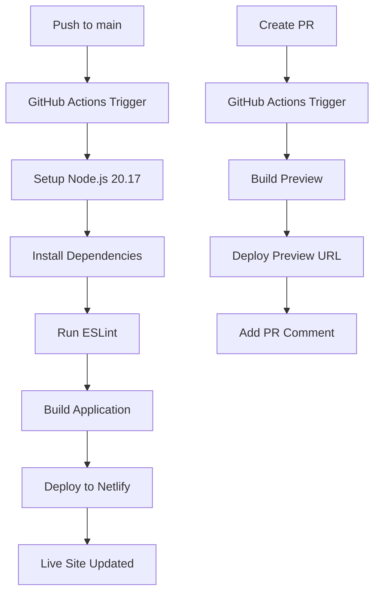

# GitHub Actions Deployment Guide

This repository includes automated deployment to Netlify via GitHub Actions.

## 🚀 Automatic Deployment

### Main Branch Deployment
When you push to the `main` branch, the following happens automatically:

1. **Code Quality Check:** Runs ESLint to ensure code quality
2. **Build Process:** Creates optimized production build
3. **Netlify Deployment:** Deploys to your live Netlify site
4. **Status Updates:** GitHub shows deployment status

### Pull Request Previews
When you create a pull request targeting `main`:

1. **Preview Build:** Creates a preview deployment
2. **PR Comments:** Adds preview link to pull request
3. **Testing:** Allows testing changes before merging

## 🔧 Required GitHub Secrets

You need to add these secrets to your GitHub repository:

### 1. Get Netlify Auth Token
```bash
# Install Netlify CLI
npm install -g netlify-cli

# Login to Netlify
netlify login

# Get your auth token
netlify tokens:create --description="GitHub Actions Deploy"
```

### 2. Get Netlify Site ID
```bash
# From your project directory
netlify link

# Get site ID
netlify status
```

### 3. Add Secrets to GitHub
1. Go to your repository on GitHub
2. Settings → Secrets and variables → Actions
3. Click "New repository secret"
4. Add these secrets:
   - `NETLIFY_AUTH_TOKEN`: Your Netlify auth token
   - `NETLIFY_SITE_ID`: Your Netlify site ID

## 📋 Workflow Features

### Quality Assurance
- **Node.js 20.17:** Ensures consistent Node.js version
- **npm ci:** Faster, reliable dependency installation
- **ESLint:** Code quality validation
- **Build verification:** Ensures app builds successfully

### Deployment Features
- **Production deployment:** Automatic on main branch push
- **Preview deployments:** For pull requests
- **Rollback support:** Netlify maintains deployment history
- **Status badges:** GitHub shows deployment status

### Notifications
- **PR comments:** Preview links in pull requests
- **Commit comments:** Deployment status on commits
- **Status checks:** GitHub shows deployment status

## 🔄 Deployment Process



## 🛠️ Local Development

### Test Workflow Locally
```bash
# Install act for local GitHub Actions testing
# https://github.com/nektos/act

# Test the workflow
act push -j deploy
```

### Manual Deployment
If you need to deploy manually:

```bash
# Build and deploy manually
npm run build
cd dist
netlify deploy --prod --dir .
```

## 🔍 Troubleshooting

### Common Issues

**Build Failures:**
- Check Node.js version (requires 20.17)
- Verify all dependencies are installed
- Check ESLint errors and fix them

**Deployment Failures:**
- Verify Netlify secrets are correct
- Check Netlify site ID matches your site
- Ensure Netlify auth token has proper permissions

**Permission Issues:**
- Make sure GitHub Actions are enabled in repository
- Check that secrets are properly configured
- Verify Netlify team permissions

### Debug Steps

1. **Check Workflow Logs:**
   - Go to Actions tab in GitHub
   - Click on the failed workflow run
   - Review each step for errors

2. **Local Testing:**
   ```bash
   # Test build locally
   npm run build
   
   # Test linting
   npm run lint
   ```

3. **Manual Netlify Deploy:**
   ```bash
   # Test Netlify connection
   netlify status
   
   # Test deployment
   netlify deploy --prod --dir ./dist
   ```

## 📊 Deployment History

Netlify maintains a complete deployment history:

- **Rollback:** Deploy any previous version
- **Branch deploys:** Separate deployments for branches
- **Preview links:** Share previews with stakeholders
- **Analytics:** Track deployment performance

## 🎯 Best Practices

### Branch Strategy
- **main:** Production-ready code
- **develop:** Feature development
- **feature/*:** Individual features
- **hotfix/*:** Critical fixes

### Commit Messages
```
feat: add new feature
fix: resolve issue
docs: update documentation
chore: maintenance tasks
```

### Pull Request Process
1. Create feature branch from main
2. Make changes and commit
3. Open pull request with description
4. Review preview deployment
5. Merge to main for production deploy

## 🔐 Security Considerations

- **Secrets Management:** Never expose tokens in code
- **Least Privilege:** Use minimal required permissions
- **Regular Rotation:** Rotate tokens periodically
- **Audit Logs:** Monitor deployment activity

---

## 📞 Support

If you encounter issues with GitHub Actions deployment:

1. Check the workflow logs in GitHub Actions tab
2. Verify your Netlify configuration
3. Review this troubleshooting guide
4. Check Netlify and GitHub documentation

**Happy Deploying! 🚀**