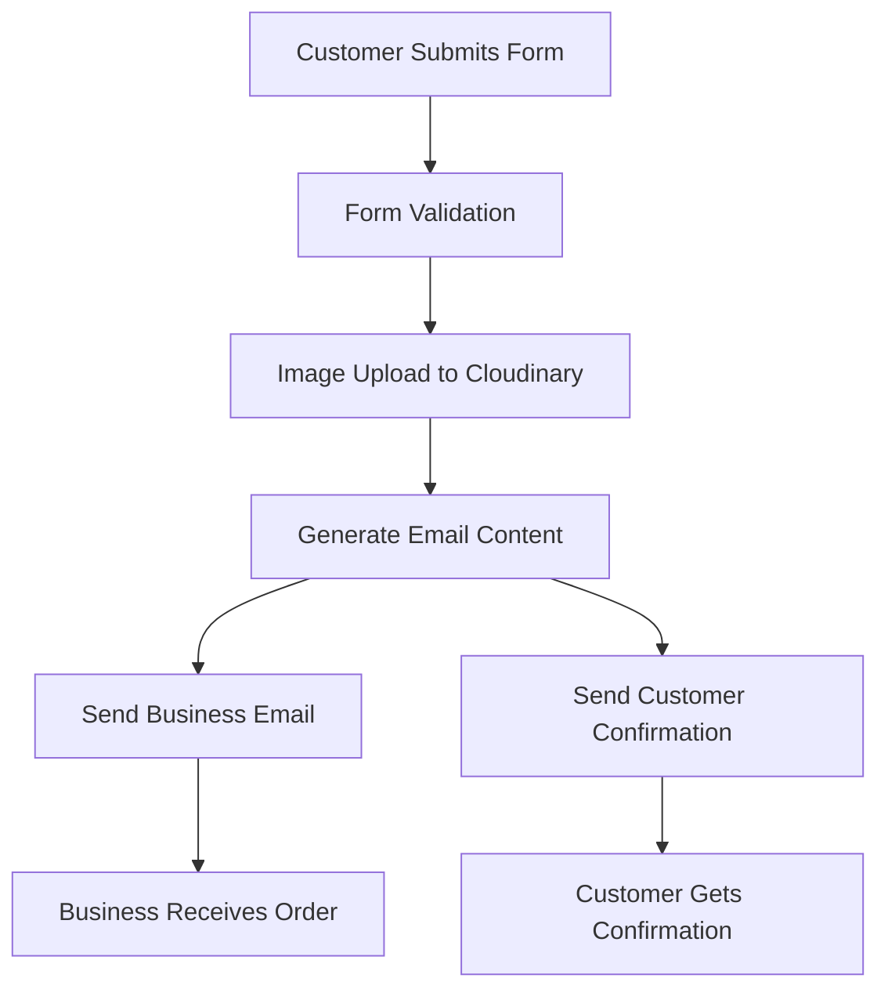
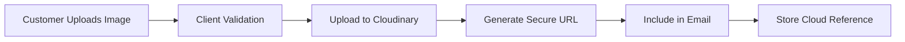

# Evelyn's Homemade Cakes 🎂

A beautiful, modern React application for a homemade cake shop with full e-commerce functionality, including custom cake ordering, image uploads, and automated email notifications.

## 🌟 Features

- **Beautiful UI/UX**: Modern design with animations, gradients, and interactive elements
- **Responsive Design**: Works perfectly on all devices
- **Dark Mode Support**: Elegant dark theme throughout
- **Custom Cake Ordering**: Complete form validation and submission
- **Image Upload**: Customers can upload cake design references
- **Email Notifications**: Automated emails to business and customers
- **Cloud Storage**: Images stored securely in Cloudinary
- **TypeScript**: Full type safety and better development experience
- **Component Architecture**: Clean, reusable React components

## 🛠️ Tech Stack

- **React 19** with TypeScript
- **Vite** for fast development and building
- **Tailwind CSS** for styling
- **React Router** for navigation
- **EmailJS** for email notifications
- **Cloudinary** for image storage
- **ESLint** for code quality
- **Netlify** for hosting (live at https://eve-cake-shop.netlify.app)

## 📧 Email System Architecture

### How Email Triggers Work

The email system uses **EmailJS** to send notifications without requiring a backend:



### Email Configuration

**Required EmailJS Settings:**
- **Service ID:** `service_qy59qqi`
- **Template ID:** `template_25f1y2h`
- **Public Key:** `XQ3TQZST-Fbe6awEX`

**Email Templates:**
1. **Business Notification:** Contains full order details, customer info, and uploaded image
2. **Customer Confirmation:** Order summary with image reference

### Email Content Structure

The email system sends:
- **Plain Text Version:** Fallback for email clients
- **HTML Version:** Rich formatting with images and links
- **Image Attachments:** Clickable links to Cloudinary images with thumbnails

## 🖼️ Image Storage System

### Cloudinary Integration

Images are stored using **Cloudinary** cloud storage:



### Cloudinary Configuration

**Account Details:**
- **Cloud Name:** `doyf9a3rl`
- **Upload Preset:** `evelyn_cakes_preset` (unsigned)
- **Folder:** `cake_orders`

**Upload Process:**
1. **Client Validation:** Max 5MB, image files only
2. **Direct Upload:** Browser → Cloudinary API
3. **URL Generation:** Secure URLs returned for email inclusion
4. **Image Preview:** Client-side preview before upload

### Image Features

- **Automatic Optimization:** Cloudinary optimizes for web delivery
- **Multiple Formats:** Supports JPG, PNG, GIF, WebP
- **Size Limits:** 5MB maximum file size
- **Secure Storage:** HTTPS URLs with CDN delivery

## 🚀 Getting Started

### Prerequisites

- Node.js (version 20.17+ recommended)
- npm or yarn
- Cloudinary account (for image uploads)
- EmailJS account (for email notifications)

### Installation

1. **Clone the repository:**
```bash
git clone https://github.com/clementanto87/eve-cake-shop.git
cd evelyn-cake-shop
```

2. **Install dependencies:**
```bash
npm install
```

3. **Configure Services:**

   **EmailJS Setup:**
   - Create account at [EmailJS](https://www.emailjs.com/)
   - Get Service ID, Template ID, and Public Key
   - Update `src/lib/emailService.ts` with your credentials

   **Cloudinary Setup:**
   - Create account at [Cloudinary](https://cloudinary.com/)
   - Create unsigned upload preset named `evelyn_cakes_preset`
   - Set folder to `cake_orders`
   - Update cloud name in `src/components/CustomOrderForm.tsx`

4. **Start development server:**
```bash
npm run dev
```

5. **Open browser:** Navigate to `http://localhost:5174`

## 📦 Available Scripts

- `npm run dev` - Start development server
- `npm run build` - Build for production
- `npm run lint` - Run ESLint
- `npm run preview` - Preview production build locally

## 🌐 Deployment Guide

### Method 1: Netlify (Recommended)

1. **Prepare for Production:**
```bash
npm run build
```

2. **Deploy via Netlify CLI:**
```bash
npm install -g netlify-cli
cd dist
netlify deploy --prod --dir . --create-site evelyn-cake-shop
```

3. **Environment Variables (Netlify):**
   - Go to Site Settings → Build & Deploy → Environment
   - Add any sensitive configuration if needed

**Live Site:** https://eve-cake-shop.netlify.app

### Method 2: Vercel

1. **Install Vercel CLI:**
```bash
npm install -g vercel
```

2. **Deploy:**
```bash
vercel --prod
```

3. **Configure Environment Variables:**
   - Add EmailJS and Cloudinary credentials in Vercel dashboard

### Method 3: GitHub Pages

1. **Update vite.config.ts:**
```typescript
export default defineConfig({
  plugins: [react()],
  base: '/evelyn-cake-shop/', // Add this line
  // ... rest of config
})
```

2. **Build and Deploy:**
```bash
npm run build
./deploy.sh
```

3. **Configure GitHub Pages:**
   - Repository Settings → Pages → Source: GitHub Actions

### Method 4: Docker Deployment

1. **Create Dockerfile:**
```dockerfile
FROM node:20-alpine
WORKDIR /app
COPY package*.json ./
RUN npm ci --only=production
COPY . .
RUN npm run build
FROM nginx:alpine
COPY --from=0 /app/dist /usr/share/nginx/html
EXPOSE 80
CMD ["nginx", "-g", "daemon off;"]
```

2. **Build and Run:**
```bash
docker build -t evelyn-cakes .
docker run -p 80:80 evelyn-cakes
```

## 🔧 Configuration Details

### EmailJS Template Setup

**Business Email Template Variables:**
- `{{to_email}}` - Business email address
- `{{subject}}` - Order subject line
- `{{message}}` - Plain text order summary
- `{{html_content}}` - HTML order details with images
- `{{reply_to}}` - Customer email for replies

**Customer Email Template Variables:**
- Same structure but customer-focused content

### Cloudinary Upload Preset Settings

**Create Unsigned Upload Preset:**
1. Go to Cloudinary Dashboard → Settings → Upload
2. Click "Add upload preset"
3. **Name:** `evelyn_cakes_preset`
4. **Signing Mode:** Unsigned
5. **Folder:** `cake_orders`
6. **Allowed Formats:** jpg, jpeg, png, gif, webp
7. **Max File Size:** 5MB
8. **Return Asset ID:** Yes

## 📁 Project Structure

```
src/
├── assets/                 # Static assets
│   ├── react.svg
│   └── images/
├── components/            # React components
│   ├── ui/               # Reusable UI components
│   ├── About.tsx
│   ├── AboutContent.tsx
│   ├── CTA.tsx
│   ├── CustomOrderForm.tsx  # Main order form with image upload
│   ├── FeaturedCakes.tsx
│   ├── Footer.tsx
│   ├── Header.tsx
│   ├── Hero.tsx
│   └── OrderConfirmation.tsx
├── data/                 # Static data
│   └── cakes.ts
├── lib/                  # Core functionality
│   ├── emailService.ts   # Email sending logic
│   └── utils.ts          # Utility functions
└── types/               # TypeScript type definitions
```

## 🎨 Customization

### Colors
- **Primary:** `#ee2b4b` (Tailwind `primary`)
- **Background:** `#f8f6f6`
- **Dark Background:** `#11080a`

### Email Customization
- Update templates in EmailJS dashboard
- Modify `emailService.ts` for custom formatting
- Add new email types as needed

### Image Storage
- Change Cloudinary folder structure
- Add image transformations
- Implement different upload presets

## 🐛 Troubleshooting

### Email Issues
- **EmailJS not working:** Check Service ID, Template ID, and Public Key
- **Templates not rendering:** Ensure HTML content is enabled in EmailJS template
- **No emails received:** Check spam folder and EmailJS usage limits

### Image Upload Issues
- **Upload fails:** Verify Cloudinary credentials and upload preset
- **Images not showing:** Check CORS settings and URL generation
- **Size errors:** Ensure file size is under 5MB limit

### Build Issues
- **Node.js version:** Use 20.17+ (warnings for older versions)
- **TypeScript errors:** Run `npm run lint` to check for issues
- **Missing dependencies:** Clear cache with `rm -rf node_modules dist && npm install`

### Image Deployment Issues

**Problem:** Images missing after Netlify deployment

**Solutions Applied:**
1. **Vite Configuration:** Simplified asset handling in `vite.config.ts`
2. **Netlify Files:** Added `_redirects` and `_headers` for proper routing
3. **Build Verification:** Added asset verification in GitHub Actions

**Files Created:**
- `public/_redirects`: Handles SPA routing and asset paths
- `public/_headers`: Proper caching headers for images
- Updated `vite.config.ts`: Simplified asset organization

**Asset Structure:**
```
dist/
├── assets/
│   ├── images/          # All images copied here
│   │   ├── hero-bg.jpg
│   │   ├── about-evelyn.jpg
│   │   └── ...
│   ├── index-*.css
│   └── index-*.js
├── index.html
├── _headers
└── _redirects
```

**Verification:**
```bash
# Check images are in build
npm run build
ls -la dist/assets/images/
```

### Deployment Issues
- **Netlify:** Ensure all assets are in `dist` folder
- **GitHub Pages:** Check base path configuration
- **Environment variables:** Verify all required variables are set

## 🔒 Security Considerations

### Client-Side Security
- **Input Validation:** All form inputs validated before submission
- **File Upload Security:** Image type and size restrictions
- **XSS Prevention:** HTML content sanitized in emails

### API Security
- **EmailJS:** Uses public keys (no sensitive data exposed)
- **Cloudinary:** Unsigned uploads with preset restrictions
- **No Backend:** Reduces attack surface significantly

## 📊 Performance Optimization

### Image Optimization
- **Cloudinary CDN:** Automatic image optimization
- **Client-Side Preview:** Efficient blob URLs for previews
- **Lazy Loading:** Images load as needed

### Build Optimization
- **Vite:** Fast development and optimized builds
- **Code Splitting:** Automatic route-based splitting
- **Asset Optimization:** Minified CSS and JavaScript

## 📄 License

This project is open source and available under the [MIT License](LICENSE).

## 🤝 Contributing

1. Fork the repository
2. Create a feature branch: `git checkout -b feature/amazing-feature`
3. Make your changes
4. Test thoroughly: `npm run lint` and `npm run build`
5. Submit a pull request

## 📞 Support & Contact

- **Business Email:** hello@evelynscakes.com
- **Live Site:** https://eve-cake-shop.netlify.app
- **GitHub:** https://github.com/clementanto87/evelyn-cake-shop
- **Issues:** Report bugs via GitHub Issues

## 🚀 Future Enhancements

- [ ] Backend API for better security
- [ ] Payment integration (Stripe/PayPal)
- [ ] Order tracking system
- [ ] Admin dashboard
- [ ] Real-time notifications
- [ ] Multi-language support
- [ ] Advanced image editing
- [ ] Inventory management

### Method 5: GitHub Actions (Automated)

**Setup Automatic Deployment:**

1. **Add GitHub Secrets:**
   ```bash
   # Get Netlify auth token
   npm install -g netlify-cli
   netlify login
   netlify tokens:create --description="GitHub Actions Deploy"
   
   # Get Netlify site ID
   netlify link
   netlify status
   ```

2. **Add Secrets to GitHub:**
   - Repository → Settings → Secrets and variables → Actions
   - `NETLIFY_AUTH_TOKEN`: Your Netlify auth token
   - `NETLIFY_SITE_ID`: Your Netlify site ID

3. **Automatic Deployment:**
   - Push to `main` branch → Automatic production deploy
   - Pull requests → Automatic preview deployments
   - Workflow includes linting and build verification

**Features:**
- ✅ Code quality checks (ESLint)
- ✅ Build verification
- ✅ Automatic production deployment
- ✅ Preview deployments for PRs
- ✅ Deployment status in GitHub UI

**Workflow File:** `.github/workflows/deploy.yml`

---

Made with ❤️ and lots of sugar for Evelyn's Homemade Cakes 🍰

**Built with modern web technologies for the best user experience.**